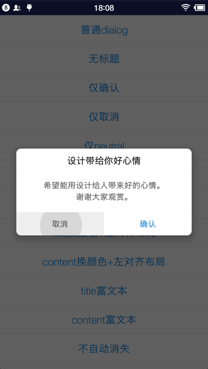

# EasyDialog
基于MaterialDialog简化，修改了dialog的UI，使之更漂亮些。



### 目前实现的有

+ 普通文本+标题+确认、取消、Neutral
+ 超长文本带滚动
+ 列表、自定义adapter
+ 自定义customView

### How To Use
------

```
	将core作为library，依赖即可
```

```java
new EasyDialog.Builder(SampleActivity.this)
	.title("设计带给你好心情")
    .content("希望能用设计给人带来好的心情。\n谢谢大家观赏。")
    .positiveText("确认")
    .onPositive(new EasyDialog.SingleButtonCallback() {
        @Override
        public void onClick(@NonNull EasyDialog dialog, @NonNull EasyButton.EasyButtonType which) {
            showToast("点击确认");
        }
    })
    .negativeText("取消")
    .onNegative(new EasyDialog.SingleButtonCallback() {
        @Override
        public void onClick(@NonNull EasyDialog dialog, @NonNull EasyButton.EasyButtonType which) {
            showToast("点击取消");
        }
    })
    .show();

```

