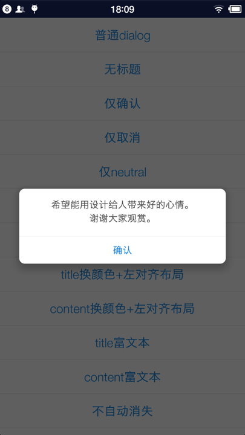
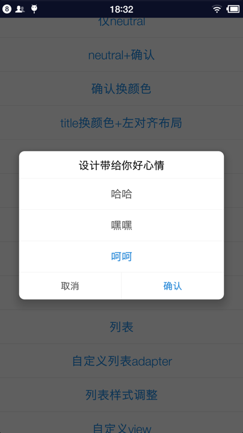

# EasyDialog

Base on [MaterialDialog](https://github.com/afollestad/material-dialogs), make it smaller and change its UI, It is much pretty than System UI , I think

(基于MaterialDialog简化，修改了dialog的UI，使之更漂亮些。)

/**/
haha


### Current Support (目前实现的有) 

+ Normal Content + Title + Buttons (普通文本+标题+确认、取消、Neutral)
+ Auto add scrollbar when content is long (超长文本带滚动)
+ List by set `Items` or set `Custom Adapter` (列表、自定义adapter)
+ customView (自定义View)

### How To Use
------

```
	use the code as library (将core作为library，依赖即可)
```

```java
new EasyDialog.Builder(SampleActivity.this)
	.title("设计带给你好心情")
    .content("希望能用设计给人带来好的心情。\n谢谢大家观赏。")
    .positiveText("确认")
    .onPositive(new EasyDialog.SingleButtonCallback() {
        @Override
        public void onClick(@NonNull EasyDialog dialog, @NonNull EasyButton.EasyButtonType which) {
            showToast("点击确认");
        }
    })
    .negativeText("取消")
    .onNegative(new EasyDialog.SingleButtonCallback() {
        @Override
        public void onClick(@NonNull EasyDialog dialog, @NonNull EasyButton.EasyButtonType which) {
            showToast("点击取消");
        }
    })
    .show();

```

### more sample

#### show one button

here we only show the positive button

```java
 builder.content("希望能用设计给人带来好的心情。\n谢谢大家观赏。")
	.positiveText("确认");
```

> 


#### change button's color

we can also change color on `Title` and `Content` 

```java
builder.content("希望能用设计给人带来好的心情。\n谢谢大家观赏。")
    .positiveText("确认")
    .positiveColorRes(R.color.font_danger)
    .negativeText("取消");
```

> 

#### use scrollView when show long content

```java
builder.title("设计带给你好心情")
    .content("《玄界之门》是起点中文网首发的一部奇幻修真小说，作者是起点白金作家忘语。\n石牧：本书男主，东洲大陆齐国越州人氏，从小生活在渔村，皮肤微微黑红，浓眉大眼。为人意志坚定，有情有义，处事从容、不卑不亢，刚强不屈。受异血附体身体产生异变\n天阴姹女：万珑山天阴宗女弟子，相救石牧被其表白，允诺他三十岁前进阶先天武者便告之本名[2] \n香珠：天蚌灵女，天生的水行术士。将异血污秽了伴生灵珠赠予救命恩人石牧，海族圣女，在勇士之门见到石牧，成为灵阶术士，在勇士之门又被石牧救了一次。\n钟秀：钟家之后受钟明所托遗孤，额头上有块青色胎记破坏了俏丽的容颜，曾经和石牧一起被金家和吴家联手追杀，三品凤音血脉，现被带往妙音宗，胎记消失，地位很高，打算进入碧波池突破先天瓶颈。[3] \n烟罗：石牧灵宠，死灵界面骷髅，能说话，实力已经进阶先天。\n珂儿：妙音宗的木属性术士学徒，天赋很高，善长木属性治愈类的术法，与石牧的关系不错。\n金小钗：炎国黑魔门地阶大长老弟子。化名韩湘绣潜伏在黑魔门劫持玄武宗的新弟子中，认识了石牧，后用黑魔蛇偷袭玄武宗风行星阶术士余千机。蛮族入侵因天阴姹女的缘故将石牧调到联盟的一处制符据点“鼠巢”，称大长老为祖爷爷，作为领头人准备带领石牧等四人参加两月之后的魔阳大典。\n")
    .contentGravity(Gravity.LEFT)
    .positiveText("确认")
    .negativeText("取消");
```

> 


#### we can use html for `content` `title` and `button`

use the html tags supported by `Android`

```java
builder.title(Html.fromHtml("设计带给你<font color='#147ed4'><i>好心情</i></font>"))
    .content("希望能用设计给人带来好的心情。\n谢谢大家观赏。")
    .positiveText("确认")
    .negativeText("取消");
```

> 

#### use list or items

we support `Array` `List` , even supprt `Adapter` . also html is supported in item.

```java
builder.title("设计带给你好心情")
    .items("哈哈", "嘿嘿", Html.fromHtml("<font color='#147ed4'>呵呵</font>"))
    .itemsCallback(new EasyDialog.ListCallback<CharSequence>() {
        @Override
        public void onItemClick(@NonNull EasyDialog dialog, @NonNull View view, @NonNull int position, @NonNull CharSequence item) {
            showToast((String) item);
        }
    })
    .positiveText("确认")
    .negativeText("取消");
```

> 

#### use customView

you can set customView to the dialog, if the customView is long,just enable the scroll.

```java
builder.title("自定义view")
    .customView(R.layout.custom_view, true)
    .positiveText("确认");
```

you can get the customView by `dialog.getCustomView()`.

> 
